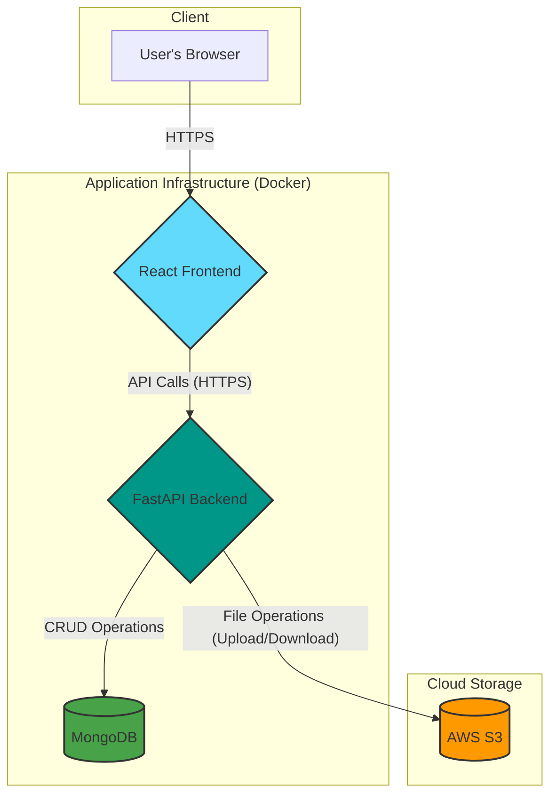
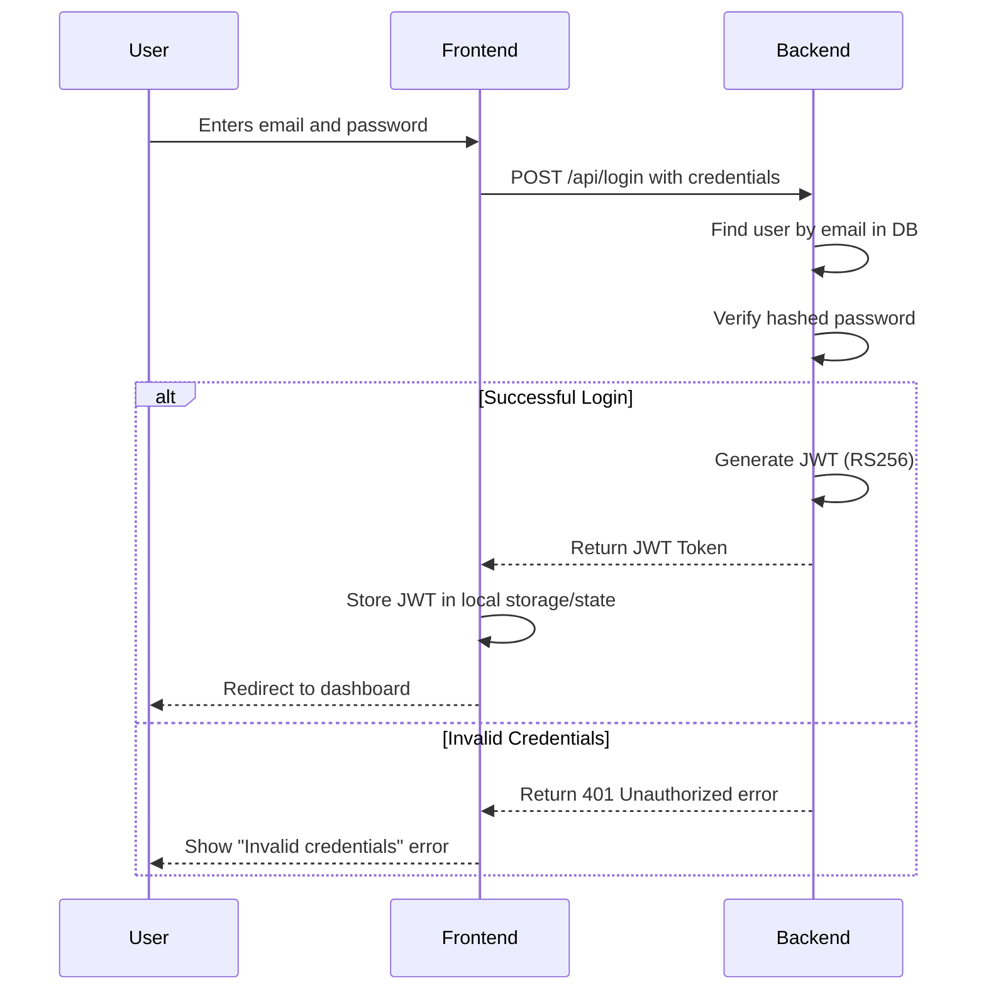
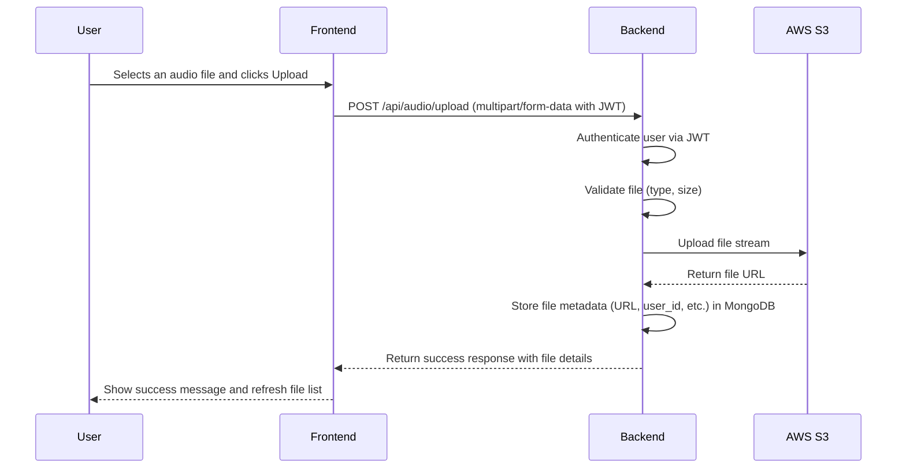
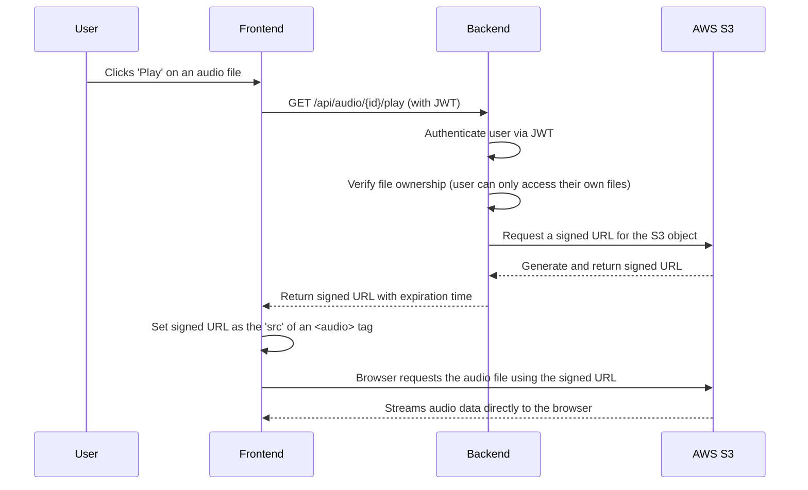

# Architecture & Flow Diagrams

This document provides diagrams illustrating the system architecture and key user flows. The diagrams are created using Mermaid syntax for clarity and version control.

## 1. High-Level System Architecture

This diagram shows the main components of the application and how they interact.

## 2. Authentication Flow (JWT)

This sequence diagram illustrates the process of a user logging in and receiving a JWT.

## 3. Audio Upload Flow

This diagram shows the steps involved when a user uploads an audio file.

## 4. Audio Playback Flow

This diagram explains how a user plays an audio file, using a secure, short-lived signed URL.

